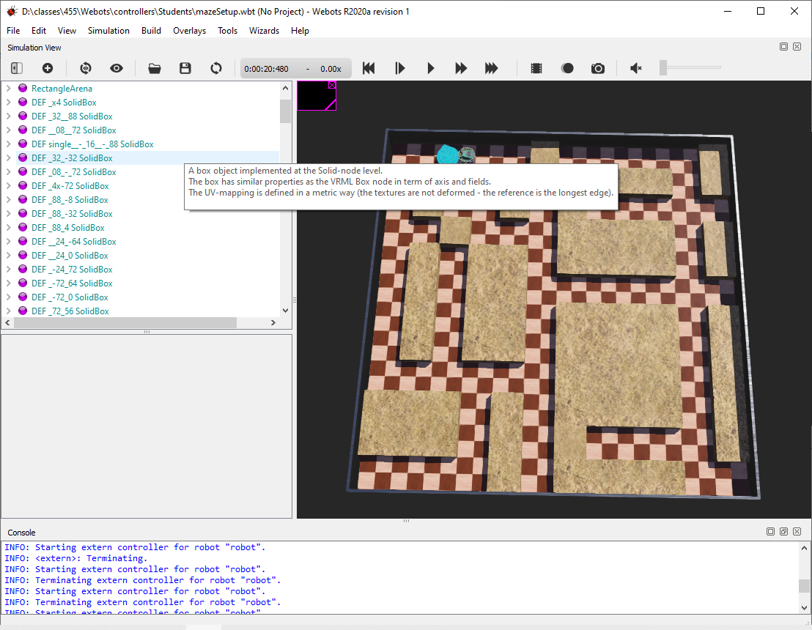

# Robot Maze - Find the Trophy

> CSCI-455 Embedded Systems: Robotics

- [Instructions](#instructions)
  - [Maze Escape](#maze-escape)
  - [What to Do](#what-to-do)
  - [Setup](#setup)
  - [Grading](#grading)
  - [How We will Grade](#how-we-will-grade)
  - [Customization of the robot or playing field](#customization-of-the-robot-or-playing-field)

## E-Puck Robot

### Specs

#### Touch Sensor

- Translation:
  - `x=0.0363`
  - `y=0`
  - `z=0.0142`
- boundingObject `Box`
  - `x=0.0025`
  - `y=0.02`
  - `z=0.01`

## Instructions

### Maze Escape

I will admit this is a little tricky.  I've completed all the steps. I just need to dial in the speeds for optimization. 

I gave you everything you need to complete the (mouse finding the cheese) maze assignment with the videos for the past two weeks. Encoders, compass, motors, touch, ePuck, etc. etc. 

You will learn the robot is very moody. 

The World you need is the next link on D2L.  The world I built comes with a maze, ePuck, and target. You will need to program the robot to find the trophy. Program the robot to find the trophy no matter where the robot starts (we will use a default starting point) or where the trophy is moved too in the maze. (No hard coding the path, has to be autonomously explored).

In class, Monday, after the program is due we will have some races,. Two mazes next to each other, place the robot and finish the same location in both mazes and see who can finish first over 3 runs.  

### What to Do

You are to write source code in Python or Java to get your ePuck robot to make it out of the maze in the shortest amount of time. 

You can run the maze **three times**, the first two are to learn the maze, the **third time to get the best time**.  After the third time all your maze data must be erased(delete your data file) and the maze resets. 

### Setup

For the assignment grading your robot will always start in the same spot.

- `x = -0.04 to -.06`
- `y = -0.6`
- rotation, if you need to start a tiny bit rotated and a little closer to one wall you can. 
- `max speed = 6.28` (I did not control it well at this speed, I slowed it down a bit)
- `step = 64`

### Grading

You get three tries, the first try your robot knows nothing about the maze, the second and third run you can use what your robot has learned about the maze. You are not allowed to change any code between all steps to get the points. You can't change the code between any number below to get the points. Only the location of the goal will change.  You can only hit-run like it's the power button on the robot.  Each goal will have a time limit which is in the parenthesis before the points on each level, so you can't just brute force for thirty minutes to find the goal. The first few you should be able to get just doing one run.  

You can use a data file to save the stuff you learned, load the data file from memory for runs two and three,  but after three runs the data file will be deleted and you start over from scratch. 

There should be no imaginary walls built into your code on run one, you know nothing about the maze. 

_**ONE SOURCE CODE FILE**_ should be able to find all the locations below under the time limits within the three runs you can take. 

1. **20 points** will be based on the quality of your source code, good object-oriented Python or Java code. If you have been using C you will need to change it to Python or Java.  I have not been doing OO in class, but my Python solution now has good OO programming. It makes it easier. 
2. (0:12:40 seconds) **20 points** your robot can find and detect the trophy at `x=-0.06`, `y=0`, when detected your code should exit and the Webots clock should stop. 
3. (0:27:00 seconds ) **10 points** your robot can find and detect the trophy at `x=0.54`, `y=-0.14`.
4. (0:56:30 ) **10 points** your robot can find and detect the trophy at `x=0.66`, `z=-0.66`. _(bottom right corner)_
5. (0:26:30 ) **10 points** your robot can find and detect the trophy at the bottom left corner `x=-0.66`, `y=-0.66`. You have to use the exact same code as in the three levels above, you would have to find the positions above in run one, and this position in run two or possibly three. 
6. (0:14:00 ) **10 points** your robot can find and detect the trophy at `x=-0.66`, `y=0.4` and not take the path that leads you to where the trophy in #5 above was located. So you try path where #5 was located on run one or two, and then on the next run, you learn that is a dead-end.  
7. (0:39:00 ) **10 points** the default trophy location `x=-0.48`, `y=0.66`
8. (0:35:46 ) **10 points** `x=-0.48`, `z=0.66` default trophy location but your path is optimal

My Record: I gave you guys a `1.44x1.44` field. Left-hand rule only record I did in 23 seconds - FASTEST TIME using a combo of left hand rule and right hand rule: 

Record on a `1.44x1.44` is `0:20:48` (pic below)

### How we will grade

First, we will put the trophy in the coordinates from #2 and make sure you can detect the trophy with your robot (print out "Win") when you hit the trophy and exit out of your code. That will give you the 20 points for #2

Then we will delete your data file, if you are using one and start from scratch. We will move the trophy to the default position. Then run your program and watch it go through all the coordinates above in the time limits and give points as your robot performs. When all the time limits are done we will stop run #1.  

We will then start your program again for run two....add any more points you get if you hit coordinates under time limits. 

Then we will do the same thing for run three. 

We will only delete a data file, we will not change any code, run a second file or create a data file. 

We will only check the robot detecting the trophy at the location of #2 and the default location in the last couple of steps. The rest of the coordinates listed above your robot will only have to drive over to get the points. 

### Customization of the robot or playing field

You can not customize the playing field or trophy, these should stay as the default world you were given, except the fact you will translate the trophy around the field. 

The robot has to be the ePuck everything must be default except for the following, you can add two items:

1. A compass keep the default parameters
2. A touch sensor to detect the trophy. You can customize where the touch sensor is located, but you can not move the sensor off the robot to the degree it is not traveling closely with the robot. In other words, you can't start the robot at the default location and the sensor is located at the trophy. It must be simulated as connected to the robot, slightly in front, right or left is fine.  You will need to let us know the coordinates of your touch sensor, that is the only thing we will do to our robot before we run it. (Our robot already has the compass and touch sensor on it).

